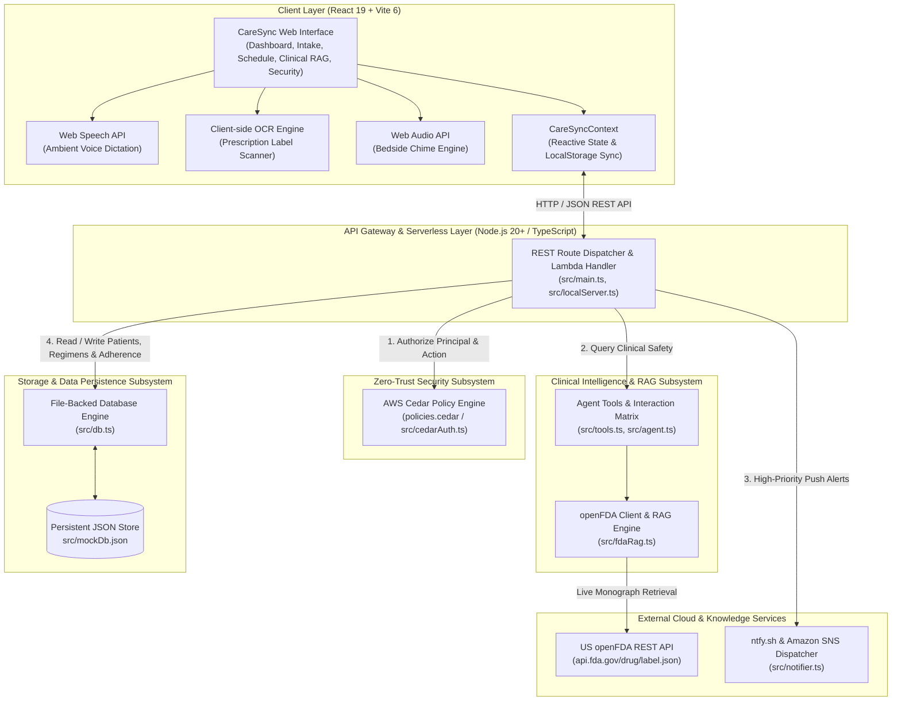
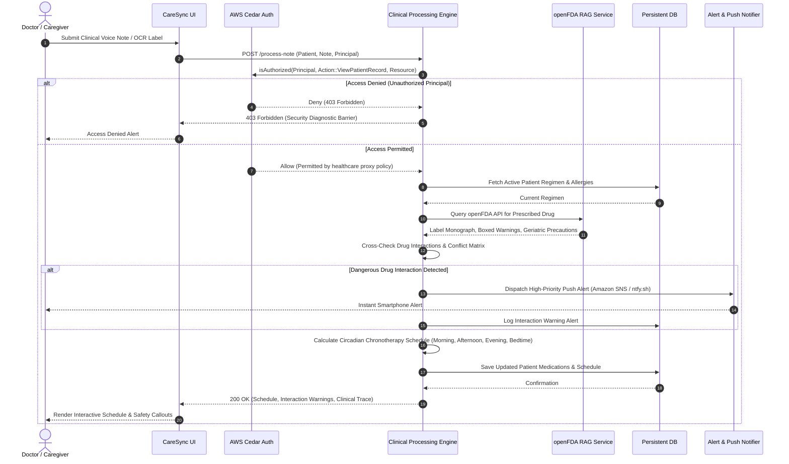

# CareSync: Intelligent Eldercare Medication Safety & Chronotherapy Platform

[](https://www.typescriptlang.org/)
[](https://nodejs.org/)
[](https://react.dev/)
[](https://vitejs.dev/)
[](https://aws.amazon.com/serverless/sam/)
[](https://open.fda.gov/)
[](https://www.cedarpolicy.com/)
[](LICENSE)
[](https://vitest.dev/)

---

## Executive Overview

CareSync is an autonomous, policy-governed clinical medication safety and chronotherapy platform built specifically for elderly care. It transforms unstructured doctor voice dictation and prescription photos into safe, structured daily pill schedules while actively intercepting dangerous drug-drug interactions (DDIs).

Every year, over 1.5 million elderly individuals suffer preventable adverse drug reactions resulting from polypharmacy, fragmented care across multiple specialists, and unconfirmed doses. CareSync bridges the gap between clinicians, elderly patients, and family caregivers through:

1. Zero-Trust Access Governance powered by the AWS Cedar Policy Engine (`policies.cedar`).
2. Clinical RAG (Retrieval-Augmented Generation) connected to the live US Food and Drug Administration (openFDA) Structured Product Label API and DailyMed monographs.
3. Computer Vision and OCR Prescription Bottle Scanner allowing caregivers to snap photos of pill bottles and import dosages with one click.
4. Live Ambient Microphone Dictation transcribing doctor voice notes directly in the browser via the Web Speech API.
5. Circadian Chronotherapy Scheduler organizing daily pills across four pharmacokinetic timing slots (Morning, Afternoon, Evening, Bedtime).
6. Smart Adherence Escalation Ladder executing a multi-tier alert sequence (bedside chime -> smartphone push notification -> emergency SMS dispatch) for missed doses.
7. Persistent File-Backed Database Engine ensuring custom medications, new patient records, clinical notes, and dose adherence checkmarks stay permanently saved across server restarts and browser reloads.

---

## System Architecture



---

## Clinical Processing and Safety Workflow



---

## Core Features and Architectural Capabilities

### 1. Zero-Trust Access Control (AWS Cedar Policy Engine)
- Formally validates healthcare proxy relationships using AWS Cedar policies (`policies.cedar`) before any patient data can be read or modified.
- Evaluates the caller's identity against the patient's authorized family set in real time:
  ```cedar
  permit (
      principal,
      action in [Action::"ViewPatientRecord", Action::"UpdateAdherence"],
      resource
  )
  when {
      principal in resource.authorized_family
  };
  ```
- Rejects unauthorized entities (such as `User::Eve`) with HTTP 403 Forbidden and visual security diagnostic alerts before clinical history or medication schedules are accessed.

### 2. Clinical RAG and Official FDA Drug Safety Explorer
- Real-time Retrieval-Augmented Generation querying the live US openFDA API (`api.fda.gov/drug/label.json`) and DailyMed monographs.
- Evaluates any prescribed medication globally (such as Lisinopril, Metformin, Warfarin, Ibuprofen, Atorvastatin, Eliquis).
- Extracts and cites:
  - FDA Black Box Warnings (highlighted in prominent clinical callout cards).
  - Geriatric Dosing and Clearance Advisories (assessing renal, hepatic, and fall risk in seniors).
  - Official Contraindications and drug interaction pharmacology.
  - Live links back to official FDA DailyMed Structured Product Label (SPL) monographs.
- Live RAG conflict analyzer compares queried medications against the active patient's current regimen, citing the exact FDA label excerpts and recommending safe clinical alternatives.

### 3. Computer Vision and OCR Prescription Bottle Scanner
- Allows caregivers to photograph or upload prescription labels, pill bottles, or blister packs.
- Executes client-side OCR extraction with laser-scanning visualization.
- Automatically parses:
  - Medication Name and Strength (for example, Metformin 500mg, Atorvastatin 20mg).
  - Sig and Administration Directives (for example, Take 1 tablet twice daily with meals).
  - Circadian Slot and Refill Details.
- One-click actions to Import Directly into Daily Schedule or Append to Clinical Intake Dictation.

### 4. Live Ambient Microphone Voice Dictation
- Uses the browser's native Web Speech API (`SpeechRecognition` / `webkitSpeechRecognition`).
- Clinicians or caregivers can toggle Live Mic Dictate to stream spoken dictation directly into the clinical intake note in real time.
- Features synthesized audio playback so elderly patients can listen to prescription instructions read aloud.

### 5. Circadian Chronotherapy 4-Slot Scheduler and Persistent Adherence
- Schedules medications across four biologically optimized windows:
  - Morning Regimen (08:00 AM): Blood pressure agents, daily maintenance.
  - Afternoon Regimen (01:00 PM): Midday doses, dietary supplements.
  - Evening Regimen (07:00 PM): Lipid-lowering agents, dinner medications.
  - Bedtime Regimen (10:00 PM): Sleep aids, nocturnal blood pressure control.
- Tactile dose checkmarks: Clicking a pill marks it as TAKEN with a timestamp. Adherence checkmarks persist to the backend database and stay checked across page reloads.
- Includes celebration effects when daily adherence reaches 100%.

### 6. Smart Adherence Escalation Ladder
- Automated multi-tier escalation protocol for missed doses:
  - Tier 1 (T + 0 min): Gentle harmonic audio chime on bedside smart tablet.
  - Tier 2 (T + 15 min): Real-time high-priority push notification sent to family caregiver's smartphone via ntfy.sh.
  - Tier 3 (T + 45 min): Critical emergency dispatch receipt with automated SMS broadcasting to emergency contacts.
- Interactive simulator allows caregivers to test all three escalation tiers with real audio and phone delivery.

### 7. Persistent File-Backed Database Engine
- Implemented in `backend/src/db.ts`, persisting state directly to disk (`mockDb.json`).
- Full CRUD capabilities:
  - Add/remove custom medications for any patient.
  - Create new elderly patient profiles with custom age, allergies, notes, and authorized family proxies.
  - Save doctor dictation notes in `localStorage`.
  - One-click database reset button to restore sample demonstration seeds at any time.

---

## Technology Stack

| Layer | Technology | Role in CareSync |
| :--- | :--- | :--- |
| **Backend Runtime** | **TypeScript 5.8 / Node.js 20+** | High-performance, strictly typed serverless service |
| **Cloud Simulation** | **AWS SAM Local / Native HTTP Server** | Local execution mirroring AWS API Gateway and Lambda contracts |
| **Security Policy Engine** | **AWS Cedar (`policies.cedar`)** | Zero-Trust RBAC/ABAC authorization before clinical data access |
| **Clinical Knowledge** | **openFDA REST API (`api.fda.gov`)** | Live US FDA Structured Product Label monographs |
| **Notifications** | **ntfy.sh and Amazon SNS Engine** | Multi-channel instant smartphone push and simulated SMS receipts |
| **Frontend Framework** | **React 19 & Vite 6** | Ultra-fast client-side reactive user interface (builds in ~130ms) |
| **Voice & Vision** | **Web Speech API & Client-side OCR** | Ambient voice dictation and prescription bottle label scanning |
| **Audio** | **Web Audio API** | Harmonic bedside chimes for Tier 1 adherence reminders |
| **Testing** | **Vitest 3.2** | Automated unit and integration test runner (16/16 tests passing) |

---

## Repository Directory Structure

```
.
├── backend/
│   ├── src/
│   │   ├── agent.ts                   # Golden path orchestration and clinical analysis loop
│   │   ├── cedarAuth.ts               # AWS Cedar Zero-Trust policy evaluation wrapper
│   │   ├── db.ts                      # Persistent file-backed JSON database engine
│   │   ├── fdaRag.ts                  # Live openFDA API query engine and RAG conflict analyzer
│   │   ├── localServer.ts             # Native Node.js HTTP runner on port 3001
│   │   ├── main.ts                    # AWS Lambda handler and REST route dispatcher
│   │   ├── mockDb.json                # Seed patient database, interaction pharmacology, alerts
│   │   ├── notifier.ts                # Multi-channel push notification and SNS alert dispatcher
│   │   ├── policies.cedar             # Cedar policy definitions for healthcare proxy access
│   │   ├── tools.ts                   # Clinical agent tools (history, interaction checks, schedule)
│   │   └── types.ts                   # Comprehensive TypeScript domain interfaces
│   ├── tests/
│   │   ├── cedarAuth.test.ts          # Cedar authorization allow/deny verification tests
│   │   ├── fdaRag.test.ts             # Live openFDA API query and RAG conflict check tests
│   │   ├── goldenPath.test.ts         # End-to-end clinical note processing tests
│   │   ├── realNotifications.test.ts  # Mobile push notification dispatch tests
│   │   └── tools.test.ts              # Regimen scheduler and drug interaction isolation tests
│   ├── package.json                   # Backend scripts and dependency manifests
│   ├── template.yaml                  # AWS SAM serverless definition (Node.js 20+ runtime)
│   └── tsconfig.json                  # Strict TypeScript compiler options
├── frontend/
│   ├── public/assets/                 # Visual concept showcases (hero dashboard, Cedar shield, schedule)
│   ├── src/
│   │   ├── components/
│   │   │   ├── AdherenceEscalationModal.jsx   # Multi-tier adherence escalation ladder and simulator
│   │   │   ├── CaregiverSnsDrawer.jsx         # Slide-out real-time emergency alert drawer
│   │   │   ├── CedarSecuritySelector.jsx      # Interactive Zero-Trust persona switcher (Alice, Charlie, Eve)
│   │   │   ├── ConflictAlertBanner.jsx        # Prominent adverse drug interaction callout banner
│   │   │   ├── ExecutionTraceModal.jsx        # Deep diagnostics and execution trace inspector
│   │   │   ├── Header.jsx                     # Sticky navigation bar with quick action buttons
│   │   │   ├── ManageMedicationsModal.jsx     # Custom medication, patient CRUD and database manager
│   │   │   ├── PillScheduleBoard.jsx          # 4-slot chronotherapy pill schedule with persistent checkmarks
│   │   │   ├── PrescriptionScannerModal.jsx   # Computer vision OCR prescription bottle scanner
│   │   │   └── VoiceNoteRecorder.jsx          # Ambient live microphone voice dictation console
│   │   ├── context/
│   │   │   └── CareSyncContext.jsx            # Global state management and localStorage persistence sync
│   │   ├── pages/
│   │   │   ├── AlertsPage.jsx                 # Mobile alert log and emergency dispatch testing page
│   │   │   ├── FdaRagExplorerPage.jsx         # Clinical RAG and live openFDA drug safety explorer
│   │   │   ├── HomePage.jsx                   # Interactive product overview landing page
│   │   │   ├── IntakePage.jsx                 # Doctor voice intake and clinical extraction console
│   │   │   ├── SchedulePage.jsx               # Daily chronotherapy pill schedule and regimen manager
│   │   │   ├── SecurityPage.jsx               # Zero-Trust Cedar access control and diagnostics view
│   │   │   └── TelemetryPage.jsx              # System architecture, telemetry and diagnostics console
│   │   ├── services/
│   │   │   └── api.js                         # REST API client with offline fallback simulation
│   │   ├── App.jsx                            # Main application layout and modal orchestration
│   │   ├── index.css                          # Design system tokens, light-mode palette, animations
│   │   └── main.jsx                           # Application entry point
│   ├── index.html                             # HTML5 template with Google Fonts typography
│   ├── package.json                           # Frontend dependencies and Vite configuration
│   └── vite.config.js                         # Vite build configuration
├── docs/                                      # Architectural specs and AWS configuration guides
│   ├── 01_ARCHITECTURE_OVERVIEW.md
│   ├── 02_AWS_LOCAL_SETUP_GUIDE.md
│   ├── 03_CEDAR_AUTHORIZATION_ENGINE.md
│   ├── 04_STRANDS_AGENT_AND_TOOLS.md
│   ├── 05_DATA_MODELS_AND_INTERACTION_MATRIX.md
│   ├── 06_EXTENDED_FEATURES_INNOVATION.md
│   ├── 07_FRONTEND_UI_SPECIFICATION.md
│   └── 08_TESTING_AND_VERIFICATION_PROTOCOL.md
├── .gitignore
├── LICENSE
└── README.md
```

---

## Quick Start: Running CareSync Locally

### Prerequisites
- Node.js: v20.0.0 or higher
- npm: v9.0.0 or higher
- Git

---

### 1. Clone the Repository
```bash
git clone https://github.com/ADITYASINGH1206/AWS-First-Commit.git
cd AWS-First-Commit
```

---

### 2. Set Up and Start Backend Serverless API
```bash
cd backend
npm install
npm run build
npm start
```
The backend starts at `http://localhost:3001`, exposing the Lambda handler via native Node.js HTTP server.

To run the automated Vitest test suite:
```bash
npm test
```
All 16 tests will execute and pass, verifying Cedar authorization, agent tools, live FDA API integration, and push notifications.

---

### 3. Set Up and Start Frontend Web Application
In a new terminal window:
```bash
cd frontend
npm install
npm run dev
```
Open `http://localhost:5173` in your browser to launch the CareSync application.

---

## REST API Endpoints Reference

The backend exposes the following REST endpoints on `http://localhost:3001`:

| Method | Endpoint | Description |
| :--- | :--- | :--- |
| `POST` | `/process-note` | **Golden Path**: Authorizes caller via Cedar, parses clinical note, evaluates drug interactions, schedules pills, and dispatches alerts |
| `GET` | `/fda/search?drug={name}` | **Live openFDA API**: Retrieves official FDA drug label, Boxed Warnings, Geriatric Precautions, and DailyMed URLs |
| `POST` | `/fda/rag-check` | **Clinical RAG**: Evaluates adverse interactions between a target drug and active regimen using live FDA label data |
| `GET` | `/patients` | Retrieves all registered patient records from the persistent database |
| `POST` | `/patients` | Creates or updates a patient profile in the persistent database |
| `POST` | `/patients/medications` | Adds a custom medication to a patient's active regimen |
| `POST` | `/patients/medications/remove`| Removes a medication from a patient's active regimen |
| `GET` | `/adherence?patient_id={id}` | Retrieves dose taken/pending checkmark logs with timestamps |
| `POST` | `/adherence` | Persists a medication dose checkmark (`TAKEN` / `PENDING`) |
| `POST` | `/escalation/trigger` | Dispatches multi-tier missed dose escalation alerts (chime, phone push, SMS) |
| `POST` | `/notify` | Dispatches multi-channel emergency alert to smartphone via ntfy.sh and simulated SNS |
| `GET` | `/alerts` | Retrieves recent emergency alerts log |
| `GET` | `/interactions` | Queries the pharmacologic drug-drug interaction matrix |
| `POST` | `/reset-db` | Restores the persistent database back to initial demonstration seed data |

---

## Security and Privacy Architecture

1. **Principle of Least Privilege (PoLP)**: Access to clinical records is denied by default. Explicit permission must be granted by Cedar policies evaluated in real time.
2. **Healthcare Proxy Guardrails**: Only authenticated family members and verified proxies listed in `resource.authorized_family` can access patient history or update adherence.
3. **Audit Trail**: Every authorization decision, drug interaction warning, and escalation dispatch is stamped with timestamps and logged to disk.

---

## Automated Testing Protocol

To execute the automated backend test suite:
```bash
cd backend
npm test
```

Expected output:
```
PASS tests/tools.test.ts (4 tests)
PASS tests/cedarAuth.test.ts (4 tests)
PASS tests/goldenPath.test.ts (1 test)
PASS tests/realNotifications.test.ts (3 tests)
PASS tests/fdaRag.test.ts (4 tests)

Test Files  5 passed (5)
Tests       16 passed (16)
```

To validate the frontend production bundle:
```bash
cd frontend
npm run build
```
Expected output:
```
built in ~130ms (0 errors, production bundle ready)
```

---

## License

CareSync is open-source software built for the **AWS First Commit Hackathon (Build It: Local / AWS-Simulated Track)**.
Licensed under the [MIT License](LICENSE).
