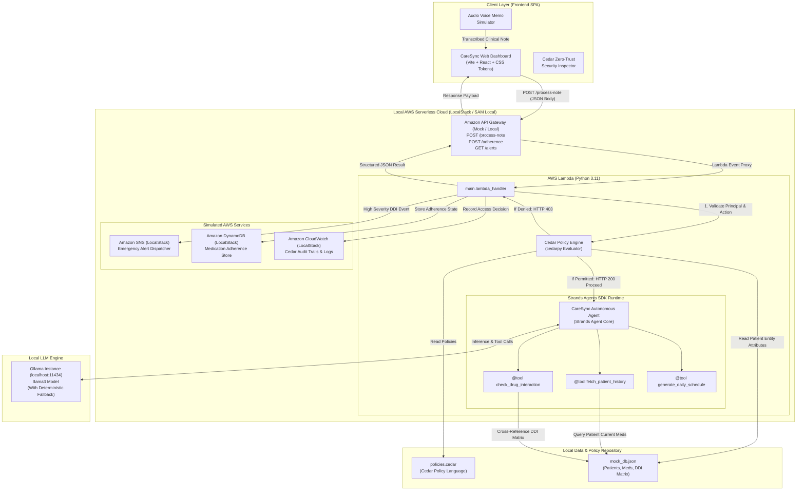
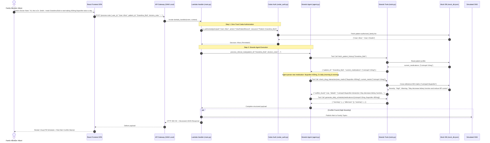

# CareSync — System Architecture Overview

**Hackathon Track:** AWS First Commit — Build It (Local / AWS-Simulated)  
**Date:** September 2026  
**Target System:** CareSync Localized AI Medication Orchestrator for Eldercare

---

## 1. Executive Summary & Vision

CareSync is a localized, zero-trust AI medication management orchestrator designed to protect elderly patients and assist caregivers. In real-world geriatric care, prescribing errors and adverse drug-drug interactions (DDIs) represent one of the leading causes of preventable hospitalizations. Doctors often communicate treatment adjustments via unstructured voice memos, phone calls, or discharge summaries. 

CareSync solves this by creating an autonomous, policy-governed workflow:
1. **Intakes** messy, conversational, transcribed clinical dictation.
2. **Enforces Zero-Trust Security** using AWS's **Cedar Policy Engine**, guaranteeing that only authorized family members and clinicians can access or update patient medication profiles.
3. **Orchestrates Autonomous Reasoning** via the **Strands Agents SDK (Python)** running against a local LLM (**Ollama Llama-3**), utilizing schema-bound tools to cross-reference patient active medication regimens.
4. **Detects Adverse Drug Interactions** in real time via an embedded pharmacology conflict matrix.
5. **Constructs an Intelligent Daily Chronotherapy Schedule** dividing medications into clinically appropriate Morning, Afternoon, Evening, and Bedtime slots.
6. **Simulates AWS Cloud-Native Services Locally** via **AWS SAM CLI**, **LocalStack**, and **Docker**, proving that modern cloud architectures can be developed, tested, and validated completely offline.

---

## 2. High-Level Architecture Diagram

---

## 3. End-to-End Sequence Flow ("The Golden Path")

---

## 4. Key Architectural Decisions

| Decision | Choice | Rationale |
| :--- | :--- | :--- |
| **Cloud Simulation** | AWS SAM CLI + LocalStack | Matches standard enterprise AWS architectures without incurring AWS cloud billing or requiring internet access during offline hackathon demos. |
| **Authorization** | Cedar Policy Engine (`cedarpy`) | Open-source, formally verifiable policy language created by AWS. Decouples permission logic entirely from application code. |
| **Agent Framework** | Strands Agents SDK (Python) | AWS's modern agent framework built explicitly for tool-use, multi-step reasoning, and deterministic structured returns. |
| **Local LLM** | Ollama (`llama3`) + Dual-Mode Fallback | True local AI execution on developer workstation. Robust fallback ensures 100% test passing even in CI/CD without GPU. |
| **Frontend Stack** | Vite + React + Vanilla CSS Tokens | Ultra-fast startup (<300ms), zero dependency bloat, dynamic glassmorphism design system. |
